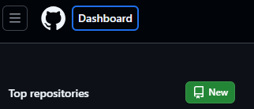

# Git pour les Noobs

## 1. C'est quoi git ?

### Mise en situation :

Un projet collaboratif à lieu avec péon 1, 2 et 3. Chacun travaille sur un fichier texte, les taches sont réparties et tout se passe bien... Enfin, sauf quand il s'agit de mettre en commun.  
En tant normal, les projets collaboratifs s'organisent autour d'un dossier partager. Chacun y dépose ses fichiers, les autres les modifient et on se partage les fichiers modifiés.

Et voilà ce qu'il peut se passer :

Péon 1 : enregistre un fichier texte en disan "Windows c'est"  
Péon 2 : Modifie le fichier texte pour ajouter " de la m*rde"  
Péon 3 : Mais le péon 3 remodifie le fichier en même temps pour remplacer "Windows" par "Linux"

A la finale : le fichier texte contient "Linux c'est de la m*rde"... Et ça c'est innaceptable !...  
Enfin c'est surtout innaceptable parce que 
* on peut pas revenir en arrière facilement, 
* on n'a pas pu se coordonner au moment de rassembler les fichiers,
* c'est le bordel !
Sans oublier péon 4 qui perd ses fichiers du projet dans son pc et qui doit tout recommencer.

Alors, si vous voulez pas passer pour des péons, il va falloir se renseigner un peu sur git !

   
(C'est ça un péon... Et c'est aussi bête que ça en a l'air)
### C'est quoi du coup ? 

Git est un logiciel de versionning !  
...  
...  
...  
C'est pas plus clair, hein ? On va voir ça de plus près.

Le versionning, c'est une manière de gérer les différentes versions d'un projet.  
Prenons le cas classique d'un fichier texte.

Imaginez vous un fichier de texte avec... Les notes de cours d'info. Lorsque vous le modifier, vous avez deux choix :
- Soit vous écrasez le fichier existant avec la nouvelle version.
- Soit vous créez un nouveau fichier à chaque modification.

Le premier choix est le plus pratique et le plus clair pour vous... Par contre aucune trace des évolutions de votre prise de notes: en cas d'erreur, vous ne pourrez pas revenir en arrière.  
A l'inverse, le second choix est tout sauf pratique: vous vous retrouvez avec une tonne de fichiers, que vous ne modifierez pas, MAIS vous pouvez revenir en arrière à volonté.

C'est là que le versionning intervient :
- Vous avez un seul exemplaires de vos fichiers, mais vous pouvez revenir en arrière à volonté.
- Vous avez un historique de vos modifications.

C'est super... Mais comment ça marche exactement ?

## 2. Petite pause installation

Avant de continuer, il va falloir installer Git sur votre ordinateur. Pour se faire, rendez-vous sur le site officiel de Git : [https://git-scm.com/](https://git-scm.com/).

A voir avec les techniciens 

   Bon, super, vous avez installé Git, toute mes félicitations... Mais concrètement, comment ça marche ?

## 3. Comment ça marche ?

Vous vous en doutez, c'est pas magique. Git a besoin de savoir ce que vous voulez faire et vous de suivre son fonctionnement.

### 3.1. Les principes de base

Git traite les fichier de votre projet dans 3 "stockages" différents :
- Le Working Directory : c'est le dossier de votre projet. Vous y travaillez. 
- L'Index : c'est un espace de stockage intermédiaire. Vous y déposez les fichiers que vous voulez ajouter à votre historique pour la prochaine version.
- Le Repository : c'est l'historique de votre projet. Vous y retrouvez toutes les versions de vos fichiers.

L'opération consistant à ajouter un fichier du Working Directory à l'Index s'appelle le "staging".  
Celle consistant à ajouter un fichier de l'Index au Repository s'appelle le "commit".

C'est bien beau tout ça, mais comment on fait concrètement ?

### 3.2. Les commandes de base

Tout d'abord, avant même d'appliquer les principes de bases que je viens d'évoquer, il faut dire à git que le dossier de votre projet... Est le dossier de votre projet. Pour faire simple, pour fonctionner à besoin de connaitre le Working Directory de votre projet afin d'y stocker les informations nécessaires à son fonctionnement. 

#### 3.2.1. Initialiser un repos (git init)

Pour se faire on va devoir INITIALISER notre répository. Pour se faire :  
1. Ouvrez un git bash/ un terminal intégrant les commandes git.  
   
2. Allez dans le dossier de votre projet `(cd "chemin/vers/le/dossier")`  
      
3. Tapez la commande `git init`  
   

Git vous informe alors que le dossier est initialisé et vous pouvez constaté, si vous avez activé l'affichage des fichiers cachés, qu'un dossier `.git` a été créé au sein de votre dossier de projet.

Note : il est possible de combiner les étapes 1 et 2 pour ouvrir git directement dans le dossier de votre choix :
1. Fait un clic droit dans le dossier de votre projet
2. Cliquez sur "Open git bash" (ou sa traduction dans la langue de votre ordinateur)  
   
3. Vous êtes dans votre dossier projet avec l'invite de commande!  
     

Vous remarquerez peut être un détail différent dans l'invite de commande... Ca là :   
"" master ""... C'est quoi ça encore ???

#### 3.2.2. Petit détour par les branches

Dabord, pas de panique, c'est normal. C'est même plutot bon signe : ça veut dire que vous êtes bien dans un répository git. 

Mais ça veut dire quoi en fait ? 

Git intègre un système de branche, et "master" ou "main" est la branche principale par défaut d'un répos (repository, c'est long à écrire). Concretement, une branche est une "copie" de votre projet à un instant T. Vous pouvez travailler sur cette copie sans impacter le reste de votre projet.

En gros : pas de panique, c'est normal et c'est cool.

Revenons à nos moutons : on a initialisé notre répository... Et maintenant ?

#### 3.2.3. Ajouter un fichier à l'Index (git add)

Bon, il est cool le projet hein ? Mais il est un peu vide... On va ajouter un fichier pour commencer. Pour l'instant, faite comme vous feriez d'habitude : créez un fichier dans votre dossier de projet.

Le fichier est vide pour l'instant, mais c'est pas grave. On va le remplir plus tard.

Disons que vous êtes fatigué et vous décider que ce serait la première version de votre projet. Pour ne pas perdre la progression et pour pouvoir revenir en arrière si besoin, on va chercher à l'ajouter à notre Repos. Pour se faire on va devoir stager le fichier : 

Dans l'invit de commande git, tapez `git add "Chemin/relatif/du/fichier"`.  

Aucun message ? tout va bien, c'est normal. Git ne vous informe que des erreurs. 
Pour verifier que le fichier à bien été ajouté à l'Index, tapez `git status`.  

Enfin un message de git... Mais décortiquons ça ensemble : 
- `On branch master` : on est sur la branche principale de notre projet. Jusque là rien de neuf sous le soleil?.
- `No commits yet` : on a pas encore ajouté de fichier à notre Repos. C'est normal, on est en train de le faire.
- `Changes to be committed` : on a des fichiers dans l'Index. C'est bon signe, ça veut dire qu'on a bien ajouté notre fichier.
- `(use "git rm --cached <file>..." to unstage)` : On verra ça dans la partie suivante (teasing). Pour l'instant, on s'en fiche.
- `new file:   Premier_fichier.txt` : notre fichier est bien dans l'Index.

Bravo! vous avez stage votre premier fichier! Avant de passer à l'étape suivante, je vais devoir parler un peu plus en détail de ce qu'on vient de faire et de ce qui gravite autour.

#### 3.2.4. Regardons dans le détail

On a vu que la commande git add permet d'ajouter un fichier à l'Index... Mais concrètement il se passe pas quoi ?

Tout d'abord, soyons très clair sur les termes : quand on dit que le fichier à été ajouter à l'index, ça signie que git à pris une "photo" du fichier à ce moment précis. C'est cette "photo" qui sera ajout à l'historique dans l'étape qui suit...

DU COUP. Imaginons que vous modifiez votre fichier APRES l'avoir ajouté à l'Index (quand je dis modifier : j'entends modifier ET enregistrer. (git ne prend pas en compte les modifications non enregistrées)). Que se passe-t-il ? 

1. Scenario 1 : vous n'ajoutez pas le fichier modifié à l'index
2. Scenario 2 : vous ajoutez le fichier modifié à l'index

##### Scenario 1 
Lorsque vous passerez à l'étape suivante, le fichier qui sera envoyé dans l'historique, sera la "photo" prise lors de l'ajout à l'Index. Les modifications apportées après l'ajout ne seront pas prises en compte. Vous aurez donc : 
* 1 version (disons 0.2) du fichier (récente) dans le Working Directory
* 1 version (disons 0.1) du fichier (ancienne) dans l'Index
* la version 0.1 dans l'historique de votre projet

##### Scenario 2
Lors du second ajout dans l'Index, git ecrasera la "photo" précédente par la nouvelle. Lorsque vous passerez à l'étape suivante, c'est cette nouvelle "photo" qui sera envoyée dans l'historique. Vous aurez donc :
* 1 version (disons 0.2) du fichier (récente) dans le Working Directory
* La même version du fichier (0.2) dans l'Index
* La version 0.2 dans l'historique de votre projet

Petit disclaimer, c'est un peu plus compliqué que ça sur la présence de chacune des version dans les différents "stockage" du système de versionnning, mais pour l'instant, c'est suffisant. On verra les subtilités plus tard. 

Super, c'était un détail important à comprendre. Mais... Et si jamais vous faites une erreur en stageant un fichier ? Pas de panique, on a déjà vu comment faire (tout est sous controle).

Si vous regarder le message afficher quand vous taper `git status` une ligne nous indique comment "unstager" un fichier : il suffit d'entrer la commande `git rm --cached "Chemin/relatif/du/fichier"`.

!!! l'option `--cached` est importante, elle permet de retirer le fichier de l'Index sans le supprimer du Working Directory. Si vous ne la mettez pas, le fichier sera supprimé de votre projet ET de l'Index. !!! 

Pour verifier que ça a bien fonctionner, retapez `git status`.  

Et voilà, le fichier n'est plus dans l'Index... MAIS git détecte bien qu'il y a eu un changement dans le dossier projet et classe ces changements non stage comme "untracked files".

On a couvert les subtilités les plus importantes, encore 2 commandes et on en aura fini pour le staging. 

Disons qu'on veut ajouter plusieurs fichiers à la fois... On fait comment ? Très simple :   
`git add "chemin/relatif/fichier1" "chemin/relatif/fichier2" "chemin/relatif/fichier3" ...`.  
On peut aussi ajouter des dossiers entiers :   
`git add "chemin/relatif/dossier1/" "chemin/relatif/dossier2/" ...`.  

Pour retirer plusieurs fichier ou dossier, même principe :   
`git rm -r --cached "chemin/relatif/fichier1" "chemin/relatif/fichier2" "fichier3" ...`  
/  
`git rm -r --cached "chemin/relatif/dossier1/" "chemin/relatif/dossier2/" ...`.

L'option -r permet de retirer les fichiers et dossiers récursivement. C'est à dire que si vous avez des dossiers dans des dossiers, ils seront retirés aussi.

Et si jamais je veux ajouter TOUT les fichiers différents de la version précédente ? Très simple : 
`git add .`. ou `git add --all`.	
Pour l'opposer, `git rm -r --cached ./`.

#### 3.2.5. Ajouter un fichier au Repos (git commit)

Felicitation ! vous avez toutes les cartes en main pour stager vos fichiers. On va pouvoir passer à l'étape suivante : le commit.

Repartons de la situation actuel : notre fichier est dans l'index, prête à être ajouté à l'historique. Pour différencier chaque nouvelle version, lors de cette étape on obligation de faire un "message de commit". Pour l'instant, ecrivez ce que vous voulez tant que vous vous comprenez, on verra lors de la tout dernière session comment faire ça "bien" (le moins pire possible disons). 

Pour commiter un fichier, tapez `git commit -m "Votre message de commit"`.

On a ici un détail de ce qu'il vient de changer entre la première et la nouvelle version de l'historique : 
* `[master (root-commit) 4a0f57b] première version` : on peut lire ici la branche (master), le message de commit (première version) et un code bizarre après. C'est ce qu'on appelle le Hash du commit. C'est un identifiant unique pour chaque commit qui pourra être utile pour des commandes plus avancés que nous verrons plus tard.
* `1 file changed, 0 insertions(+), 0 deletions(-)` : ça parle de soi même non ? On a changé un fichier, mais on a rien ajouté ni supprimé. C'est normal, on a juste ajouté le fichier à l'historique.
* `create mode 100644 Premier_fichier.txt` : cette ligne détaille les paramètrage de permission on été ajouté au fichiers ajouter au repos. N'en tenez pas compte, ce n'est utile que pour des utilisations très techniques.

Voilà ce qu'il faut retenir de cette dernière étape : TOUS LES FICHIERS ACTUELLEMENT DANS L'INDEX SERONT AJOUTÉS À L'HISTORIQUE. Si vous voulez ajouter un fichier à l'historique, il faut le stager avant. 

Et voilà, vous avez fait votre premier commit ! Vous avez ajouté une version de votre projet à l'historique.

Maintenant je vous vois venir... Vous vous dites "c'est bien beau tout ça, mais comment je fais pour revenir en arrière ?". Malheureusement, cette une manipulation un peu plus complexe que les précédentes, donc je la reserve pour une prochaine session (teasing#2), mais promis, j'ai pas menti sur le fait de pouvoir revenir en arrière.

## 4. Et Github dans tout ça ?

Je parie que vous pensez que c'est pareil que Git... Et bien non ! Github est une plateforme en ligne qui permet de stocker vos repos en ligne. C'est un peu comme un cloud pour vos projets. Il en existe d'autres, comme GitLab, Tower, etc, mais Github est le plus connu et le plus utilisé.

Vous pouvez y stocker vos repos, les partager avec d'autres personnes, travailler à plusieurs sur un même projet, etc. Toutefois chaques choses en son temps, c'est pas pour tout de suite tout ça... Mais promis, on en reparlera (teasing#3).

Par contre, On va voir comment on fait pour utiliser github avec git, car il y a des choses essentiels à savoir pour utiliser le plein potentiel de git. En effet, git est purement LOCAL, c'est à dire que tout ce que vous faites avec git est sur votre ordinateur. Pour partager vos projets, il vous faudra utiliser une plateforme en ligne comme Github... A moins de vouloir envoyer votre repo par mail, mais je vous déconseille fortement cette méthode.

On commence ? 
### 4.1 Créer un compte Github

Bah... Allez y quoi. C'est gratuit, c'est rapide et tout est expliqué sur le site. Je vais pas vous faire un dessin.

### 4.2 Configurer git pour Github

Avant de pouvoir envoyer vos fichiers sur Github, il va falloir dire à git qui vous êtes. Pour se faire, on va devoir configurer git et ya 2 choses à savoir :
1. Il existe 3 niveau de configurations : local, global et system.
2. La configuration n'est pas la même pour linux et windows (encore).

Commmençons par décrire les différents niveaux de configuration ! 
#### 4.2.1. Les niveaux de configuration
- Local : la configuration est propre à un seul repos. Elle est stockée dans le dossier .git/config du repos.
Elle est prioritaire sur les autres configurations.
- global : la configuration est propre à un utilisateur. Elle est stockée dans le fichier .gitconfig de votre dossier utilisateur. 
Elle est prioritaire sur la configuration system.
- system : la configuration est propre à un ordinateur. Elle est stockée dans le fichier /etc/gitconfig de votre ordinateur.

il faut donc noter que la configuration global est prioritaire sur la configuration system, et que la configuration local est prioritaire sur la configuration global.

Ce qui signifie que :
- la configuration system est la configuration par défaut de git et est appliqué à tous les utilisateurs de l'ordinateur qui se servent de git.
- la configuration global est la configuration par défaut de git pour un utilisateur donné et elle est appliqué à tous les repos de cet utilisateur par défaut.
- la configuration local est la configuration propre à un repos donné et elle est appliqué à ce repos uniquement. 

Cela signifie que : plusieurs utilisateurs peuvent avoir leur propre configuration mais surtout qu'un même utilisateur peut avoir une configuration par projet.

Maintenant que vous savez ça, passons à la configuration de votre git
#### 4.2.2. Configurer basic de git

Pour Linux ou windows, il faut d'abord renseigner votre username et votre email. Pour se faire, on va entrer les commandes suivantes dans un terminal git lancé dans le dossier de votre projet :
1. `git config --<local|global|system> user.name "Votre nom sur github"` : renseigne votre nom
2. `git config --<local|global|system> user.email "Votre email sur github"` : renseigne votre email

Ici, je vous laisse le choix de la configuration que vous voulez utiliser. Pour ma part, je vous conseille la configuration global, au vu de la simplicité de la commande et de l'utilisation à venir que vous aurez de git. 

Note : mettre `--local` ou ne rien mettre revient au même.

Bien, c'est maintenant que linux et windows diverge. Pour windows, c'est terminer... Pour Linux, il vous reste une étape : la configuration de votre clé SSH. Avant de continuer, j'ajoute que cette étape peu également avoir lieu sur windows, mais je ne connais pas les cas d'utilisation de cette configuration.

#### 4.2.3. Configurer votre clé SSH

La clé SSH est une clé de sécurité qui permet de sécuriser les échanges entre votre ordinateur et Github. Pour se faire, on va devoir générer une clé SSH et la lier à votre compte Github. Pour se faire, suivez les instructions de Github : [https://docs.github.com/en/github/authenticating-to-github/connecting-to-github-with-ssh](https://docs.github.com/en/github/authenticating-to-github/connecting-to-github-with-ssh)

1. On commence par générer une clé ssh dans un terminal et on la lie à son adresse mail github  avec la commande suivante : 
`ssh-keygen -t ed25519 -C "your_email@example.com"`
2. On choisi un fichier dans lequel stocker cette clé ssh quand ça nous est demandé ou en prend le chemin par defaut.
3. On choisi une "phrase de passe" (passphrase) et on l'entre à 2 reprise
4. Vous devez ensuite ajouter cette clé à votre ssh agent avec la commande  
`eval "$(ssh-agent -s)"`   
puis  
`ssh-add ~"chemin/vers/votre/clé/ssh"`
5. On ajoute maintenant cette clé à votre compte github
   1. On copie le contenue de la clé ssh généré juste avant
   2. Sur github, on va dans : photo profil du compte> paramètres > acces > clé SSH > nouvelle clé ssh/ajouter une clé ssh.
   3. Voila quoi mettre dans les différents champs 
      * Title : un titre pour votre clé qui en décrit l'origine et/ou l'usage
      * Type de clé : authentification ou signature (je ne sais pas ce que ça change)
      * Clé : coller le contenue de votre clé public ssh
   4. cliquez sur "ajouter une clé ssh"
6. Verifions que tout est en ordre.

Et voilà, vous avez configuré votre clé SSH. Vous pouvez maintenant utiliser git avec Github en toute sécurité.

Avec tout ça, vous êtes fins prêts pour utiliser git avec Github. On va voir comment faire ça tout de suite.

### 4.3 Votre premier remote repos

2 voies s'offrent à vous pour ajouter un remote à github :

#### 4.3.1. Créer un repos sur Github et le récuprer sur votre ordinateur

1. Allez sur votre compte Github
2. Cliquez sur le bouton 
   * "New" en haut à droit   
    
   * Sur le bouton "New repository" sur la page d'accueil après avoir renseigner le nom du repos et son type (public rend le repos visible par tous, privé uniquement par ceux autorisés) 
  
3. Une fois sur la page de votre repos 

   * Copier le lien HTTPS de votre repos
   * Copier le lien SSH de votre repos (Je ne connais pas les cas d'utilisation de ce lien)
4. Dans votre terminal, aller dans un dossier parent, et tapez la commande suivante :  
   `git clone "lien HTTPS ou SSH de votre repos" "nom du dossier de votre projet"` 
   

Vous venez de cloner votre remote repos sur votre ordinateur : un dossier vient d'apparaitre. C'est une opération très utile et surtout très courante, gardez la en tête.
  
Vous pouvez maintenant travailler sur votre projet. Nous verrons bientôt comment envoyer vos modifications sur Github. 

Mais avant, voyons comment effectuer l'opération dans l'autre sens : créer un repos local et le déposer sur github. 

#### 4.3.2. Créer un repos local et le déposer sur Github

Reprenons notre exemple de tout à l'heure : vous avez initialisé un repos local, vous avez ajouté un fichier et vous l'avez commit. Vous avez donc un repos local prêt à être envoyé sur Github.

1. Allez sur votre compte Github
2. Comme tout à l'heure, créez un nouveau repos MAIS n'initialisez pas le repos avec un README.md ou quoi que ce soit d'autre. Le repos doit être vierge.
3. Une fois sur la page de votre repos, copiez le lien HTTPS ou SSH de votre repos.
4. Dans votre terminal, allez dans le dossier de votre projet et tapez les commandes suivantes :  
   1. `git remote add origin "lien HTTPS ou SSH de votre repos"` vous signifiez à git que ce répos LOCAL est lié au repos DISTANT que vous venez de créer sur Github sous le nom "origin". (origin est un nom par défaut, vous pouvez le changer si vous voulez et donc travailler sur plusieurs repos distants différents... Mais on verra ça une autre fois)  
   
   2. `git remote -v`  vous permet de vérifier que le lien a bien été ajouté.   
      
   (J'aimerais vous expliquer les 2 lignes mais j'en suis incapble... Donc je vous dis juste que c'est normale d'avoir 2 lignes et que c'est normal que les liens soient les mêmes)

Parfait : votre repos local est lié à votre répos distant !

Mais si vous retournez sur github, vous verrez que votre repos est toujours vide... Normal, vous n'avez pas encore envoyé vos fichiers sur Github. On va voir ça tout de suite.

### 4.4 Comment envoyer vos fichiers sur Github (git push)

Vous avez fait un commit, vous avez un repos local et un repos distant lié l'un à l'autre... Il ne vous reste plus qu'à envoyer vos fichiers sur Github. On a juste un cas particulier : le premier envoi.

En effet, lors du premier envoi, vous allez devoir préciser à git que vous voulez envoyer votre branche principale (master) sur Github. Pour se faire, tapez la commande :  
`git push -u origin master`
* `push` : envoi les fichiers du repos local sur le repos distant
* `-u` : permet de lier la branche master de votre repos local à la branche master de votre repos distant. C'est une opération à faire une seule fois, lors du premier envoi.
* `origin` : le nom du repos distant qu'on a donné tout à l'heure.
* `master` : la branche principale de votre repos local et la branch du repos distant à laquelle vous voulez lier votre branche locale. (je vais investiguer si il est pas possible de lier une branche locale à une branche distante différente)  

  
Détailler cette réponse n'est pas très utile, mais on peut voir que : 
* Les fichiers ont bien été envoyé sur Github 
* ` * [new branch]      master -> master` : qu'une nouvelle branche a été créé sur le repos distant sous le nom "master".
* `branch 'master' set up to track 'origin/master'.` : la branche master de votre repos local est bien lié à la nouvelle branche master de votre repos distant. 

Et maintenant, si vous retournez sur Github, vous verrez que vos fichiers sont bien là !

Pour les prochains envois, vous n'aurez qu'à taper `git push` pour envoyer vos fichiers sur Github.

Pour information, vous pouvez modifier un fichier sur github directement. Alors mettons nous en situation : vous constatez une erreur dans votre fichier sur github et decidez de le modifier directement sur la plateforme. A votre avis, il se passe quoi sur le repos local ?

### 4.5 Comment récupérer les fichiers de Github (git pull)

Vous avez modifié un fichier sur Github... Est-ce que ça se répercute sur le repos local ? Et bien non... En tout cas, pas automatiquement! On va juste détailler 2 situations : 
1. Vous avez modifier un aspect du repos sans toucher au fichier (ajout d'une branche, par exemple)
2. Vous avez modifier un fichier

Dans le premier cas, il faut actualiser l'état du répos avec la commande :  
`git fetch --All`   
Cette commande permet de récupérer les informations du repos distant et de mettre à jour celle du repos local.

Dans le second cas, il faut utiliser la commande :  
`git pull` 
Cette commande, elle, permet de TIRER les données du repos distant pour les mettre dans le repos local. Toutes les modifications apportées sur le repos distant seront donc appliquées sur le repos local et le working directory sera également mis à jour. 

Le pull a pour effet de rajouter le commit créer à distance à l'historique du répos local : vous êtes donc à jour sur les versions du projet.

Precision : la mise à jour du working directory est automatique MAIS partielle. Je détaillerais ça dans une prochaine session mais noté que c'est une commande plus complexe qu'il n'y parait. Cependant, les modifications non enregistrées seront détectés par git et vous ne pourrez pas faire de git pull tant que vous n'aurez pas enregistré vos modifications.

### 4.6. Précautions à prendre

Vous avez vu que git est un outil puissant... Mais il peut être dangereux si vous ne faites pas attention. Voici quelques précautions à prendre pour éviter les problèmes :
1. Evitez de créer 2 commits différents à 2 endroits différents en même temps... Pas clair ? Exemple : 
   1. Vous modifiez un fichier sur votre ordinateur et vous faites un commit.
   2. Vous modifiez le même fichier sur Github et vous faites un commit.  
   ==> Vous avez 2 versions différentes d'un même projet... Et git ne sait pas laquelle garder.
      * Le push ne fonctionnera pas car le depot distant aura un commit d'avance sur le depot local
      * Le pull ne fonctionnera pas car le depot local aura un commit d'avance sur le depot distant  
   
   Vous devrez alors résoudre le conflit manuellement... Et c'est pas toujours simple. Et vous n'avez pas encore les outils pour le faire. On verra ça dans les sessiosn à venir (teasing#4). 
2. NE SUPPRIMEZ PAS LE DOSSIER .git. C'est le dossier qui contient toutes les informations de git. Si vous le supprimez, vous perdez tout l'historique de votre projet.

J'en ai pas vraiment d'autres en tête... Mais si vous avez des questions, n'hésitez pas à les poser.

## 5. Conclusion

Felicitation : vous êtes arrivé au bout de cette première sessions et vous êtes maintenant prêt à utiliser git pour vos projets solo et les partager. Soyez très prudents toutefois, vous n'avez pas encore tous les outis pour gérer les conflits et erreurs... Mais n'ayez crainte, on verra ça dans les sessions à venir.  

Dans la prochaine session, on va voir quelques commandes un peu plus avancés, notamment pour revenir en arrière et se sortir des situations compliquées.

## 6. Au fait...
Ha et j'oubliais: ce cours a été entièrement réalisé dans un repos git... Quand je vous disais que c'était puissant ! ;)