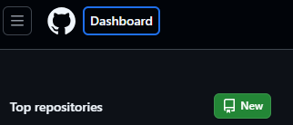
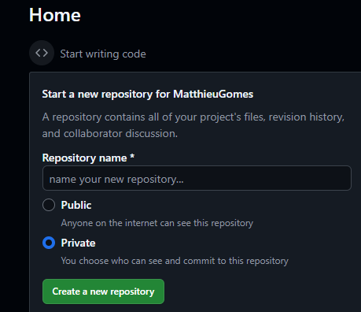
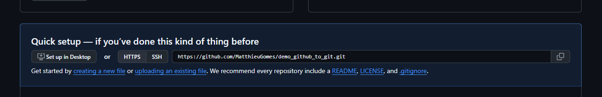

# Git pour les noobs
## 1. A quoi ça sert git ?

Si vous voulez :
- bosser en groupe sur un même projet sans vous marcher sur les pieds
- pouvoir voir l'historique de vos modifications
- et centraliser vos fichiers de projets 
- ne pas passer pour un parfait incompétent en entreprise (et même flex un peu d'ailleurs)

Git est fait pour vous !   
En effet, git est un logiciel de versionning, c'est à dire qu'il gère des version d'un même projet en gardant en mémoire les modifications apportées à chaque version. Ainsi, les modifications sont tracées (sous forme de commits), les fichiers centralisées au même endroit (appelé répository), et son réversibles (on peut revenir en arrière si on a fait une connerie).

Le but de cette première formation est de permettre d'utiliser git de façon basique, c'est à dire : 
1. créer un repository
2. faire un commit
3. cloner un repository github
4. pusher sur github
5. puller depuis un répository github

## 2. Créer un repository

Pour ça, on va commencer directement par un peu de pratique.
### 2.1 En pratique
1. Commencez par installer Git sur votre machine : rendez vous sur [le site officiel de git](https://git-scm.com/) et téléchargez la version correspondant à votre système d'exploitation.  
   *Je ne detaille pas les étapes d'installation, c'est assez simple : cliquez sur "next" jusqu'à la fin.*
2. Ouvrez git bash
3. Choisissiez un dossier où vous voulez créer votre repository et entrez la commande  
   ```cd "chemin du dossier"```
4. Ensuite, tapez la commande  
   ```git init```
5. Vous avez créé un repository local ! Félicitations ! 

*Le fait que vous soyez dans un répos git est indiqué par un mot entre () dans votre invite de commande (ici master ou main)*

### 2.2. Comment ça marche ?        

1. La commande cd est un classique du bash : suivie d'un chemin, elle permet au terminal de se déplacer dans le dossier indiqué.
2. git init, quant à lieu va créer un dossier caché ".git" dans le dossier ou il se trouve.

Essayez de deviner ce que fait ce dossier (indice : supprimez le et actualisez votre terminal (en appyant juste sur entrer par exemple))

Vous l'avez compris : le dossier .git contient toutes les informations nécessaires à git pour gérer les versions de votre projet. Il contient notament les commits... Qu'on va voir tout de suite !

## 3. Faire un commit

Faire un commit est l'action qui donne tout son sens à git et on va tout de suite voir comment faire.

### 3.1. En pratique

1. Dans votre dossier, créez un fichier texte (test.txt par exemple) mais laissez le vide.
2. Dans votre terminal, tapez la commande ```git add "chemin relatif du fichier/fichier.txt"```
3. Ensuite, tapez la commande ```git commit -m "message de commit"```
4. Vous avez fait un commit ! Félicitations !

Mais on va verifier ça tout de suite : tapez la commande ```git status``` et vous verrez que votre fichier est bien commité et votre commit est bien noté.

### 3.2. Comment ça marche ?

Pour bien comprendre ce qu'il se passe, il faut comprendre comment git gère les fichiers. En fait, l'espace est divisé en 3 espaces différents:
- Le working directory : c'est l'espace où vous travaillez, où vous créez vos fichiers, les modifiez, etc.
- L'index : c'est l'espace où vous préparez vos fichiers pour le commit. C'est à dire que vous ajoutez les fichiers que vous voulez commité.
- Le repository : c'est l'espace où git stocke les versions de vos fichiers.

Maintenant qu'on sait ça, on peut avancer : 

1. git add : cette commande permet d'ajouter un fichier de votre working directory à l'index.
2. git commit -m "message":
   1. commit : cette partie de la commande pousse le fichier de l'index au repository 
   2. -m "message": permet de rajouter un message à votre commit, afin de plus facilement les retrouver dans le futur.

Voilà pour la base du commit ! Je vais vous montrer quelques autres commandes en lien avec les commits pour vous éviter quelques problèmes et vous offrir un peu plus de liberté.

### 3.3. Commandes utiles en lien avec les commits

#### 3.3.1. Ajouter/retirer plusieurs fichier/dossiers de l'index

Petite exercice : 
1. Ajoutez 1 autre fichier à votre dossier
2. Modifier le contenu du premier fichier
3. Ajoutez les 2 fichiers à l'index
4. Verifiez avec `git status`

Comment faire ? 
<details>
<summary>Réponses</summary>

Méthode 1:   
```git add "chemin relatif du fichier/fichier1.txt"```  
```git add "chemin relatif du fichier/fichier2.txt"```

1. Méthode 2 :  
```git add "chemin relatif du fichier/fichier1.txt" "chemin relatif du fichier/fichier2.txt"```
1. Méthode 3 :
```git add .``` ou ```git add --all```
</details>  


*La 3ème méthode permet d'ajouter tous les fichiers ayant subie une modification par rapport au fichier stocké en index.*

une fois fait : commitez avec "exercice ajout de fichiers multiples" comme message.

Nouvel exercice ajouter un dossier: 
1. Créez un dossier
2. Ajoutez le à l'index
3. Entrez ```git status```

Que remarquez vous ? Non, le dossier n'a pas été ajouté à l'index. Pourquoi ?
<details>
<summary>Réponses</summary>
Le dossier est vide : git ne prend pas en compte les dossiers vides. 
</details>

Solution ? Ajoutez un fichier dans le dossier et recommencez l'opération.

Une fois fait : commitez avec le message "exercice ajout de dossier".

Encore un exercice :

1. Modifier le contenu du fichier1 et du fichier2
2. Créer un fichier3
3. Créer 3 dossier (avec un fichier) : dossier1, dossier2 et dossier3
4. Ajouter le fichier1, le fichier2, le fichier3, le dossier1 et le dossier2 à l'index
5. Mince, vous vous êtes trompé et vous ne souhaitez pas commiter le fichier 2 : retirez le de l'index
6. Mince, vous vous êtes trompé et vous ne souhaitez pas commiter le dossier 1 : retirez le de l'index
7. Finalement, vous ne garderez pas le fichier3 : retirez le de l'index et supprimez le du projet
8. Finalement, vous ne garderez pas le dossier2 : retirez le de l'index et supprimez le du projet
9.  Verifiez avec `git status`

Comment faire ? 

*indice 1 : vous connaissez les termes, donc vous pouvez chercher sur internet*  
*indice 2 : il y a une différence pour le retrait pour les fichiers et les dossiers !*  
*indice 3 : faites attention, il y a une différence importante entre les 5/6 et les 7/8 (en une seule commande)*

<details>
<summary>Réponses</summary>

Vous savez déjà faire les 4 premières étapes. Donc passons directement aux dernières étapes !

`git rm --cached "chemin relatif du fichier/fichier2.txt"`  
`git rm --cached -r "chemin relatif du dossier/dossier1"`  
`git rm "chemin relatif du fichier/fichier3.txt"`  
`git rm -r "chemin relatif du dossier/dossier2"`

- Pour retirer quelque chose de l'index, on utilise donc `git rm --cached`; quand il s'agit d'un dossier, on ajoute l'option `-r` qui signifie "recurissif" permettant de retirer toute l'arborescence du dossier.  
- Pour supprimer un fichier/dossier du projet, on utilise `git rm` sans l'option `--cached`. Cela à donc l'effet du retrait de l'index et de la suppression du fichier/dossier du projet. (une fusion de la command `rm` et de la commande `git rm --cached`)

Pour finir : commitez avec le message "exercice retrait d'element de l'index".
</details>

Dernier exercice : 

1. Créer un fichier4
2. Ajouter le fichier4 à l'index
3. Commitez avec le message "version 1"
4. Modifier le contenu du fichier4
5. ajoutez le fichier4 à l'index
6. Modifier le contenu du fichier4
7. verifier avec `git status`

Que deduisez vous ?

<details>
<summary>Réponse</summary>

Votre working dir n'est pas exactement votre index. Vous pouvez possédez 3 versions simultanément d'un même fichier : 
- la version 1 dans le repos
- la version 2 dans l'index
- la version 3 dans le working dir

Faites bien attention à ça !
</details>

ET VOILA ! Vous avez fait le tour des commandes de base pour les commits ! Félicitations ! (presque, mais c'est assez... juste faites gaffe à ce que vous commitez, svp)

## 4. Communiquer avec un serveur distant

Enfin on parle de GITHUB. OUI, il y a git dans le nom... Mais c'est pas pareil... Mais on va voir ça ! GitHub est un serveur distant qui stocke des répos... Et potentiellement les vôtres !

### 4.1. S'inscrire sur Github

Bon je vais pas vous exliquer comment faire, c'est assez simple. Rendez vous sur [le site de github]("https://github.com"). D'ailleurs utilisez votre mail ENSEA et mettez pas un prénom trop con...

### 4.2. Créer un répository

Cliquez sur new, en haut a droite  
  
ou  

1. Choisissez le nom de votre repository identique à celui de votre dossier
2. Choisisez public ou private (public sera mieux pour les projets) et ne selectionnez pas "initialize this repository with a README".

### 4.3. Configurer votre git
#### 4.3.1. En pratique
Maintenant que tout est prêt coté github, il faut configurer votre git pour qu'il sache quel est votre compte github. Pour ça, entrez les commandes suivantes :  
```git config --global user.name "votre nom github"```  
```git config --global user.email "votre mail github"```

Si vous êtes sur Linux, l'opération est un peu différente, il faut également créer un clé SSH : 
1. Entrez `ssh-keygen -t ed25519 -C "your_email@example.com"`
2. Entrez un nom de fichier (ou laissez vide pour le nom par défaut) 
3. Entrez à 2 reprise un mot de passe (ou laissez vide pour ne pas en mettre)
4. Vous devez ensuite ajouter la clé SSH à votre agent SSH : 
   1. Démarrez l'agent SSH : `eval "$(ssh-agent -s)"`
   2. Ajoutez votre clé SSH à l'agent SSH : `ssh-add ~/.ssh/id_ed25519`
5. Copiez le contenu de votre clé publique (nomDuFichier.pub)
6. Rendez sur GitHub pour ajouter la clé SSH au compte github
   1. photo profil du compte> paramètres > acces > clé SSH > nouvelle clé ssh/ajouter une clé ssh.
   2. Voila quoi mettre dans les différents champs 
      * Title : un titre pour votre clé qui en décrit l'origine et/ou l'usage
      * Type de clé : authentification ou signature (je ne sais pas ce que ça change)
      * Clé : coller le contenue de votre clé public ssh
   3. cliquez sur "ajouter une clé ssh"

### 4.3.2 Que vient-on de faire ?

Je penses que le principal (user.name et user.email) est assez clair. Ce qui l'est moins, c'est "--global".

Il existe en fait 3 niveaux de configuration pour git :
- --local : configuration pour un seul projet
- --global : configuration pour tous les projets correspondant à l'utilisateur
- --system : configuration pour tous les projets de votre machine (tous les utilisateurs)

Pour la clé SSH, c'est plus compliqué, mais la seule chose à retenir c'est que sans, github ne peut pas communiquer de manière sécurisée avec votre machine... Donc elle communique pas du tout. 

### 4.4. Cloner un repository (git clone)

La première opération à connaire dans l'utilisation de github est comment cloner un repository. Pour ça, rien de plus simple :

1. Allez dans le dossier de votre choix avec le terminal
2. Entrez la commande ```git clone "lien du repository" "nom du dossier de destination"```

Vous trouverez le lien du repository sur la page de votre repository github, ici : 


Tadam ! Un dossier vient d'apparaitre. Dirigez vous dedans et vous verrez que tout le contenu de votre repository github est là ! Cette fois, c'est vite, mais le terminal reconnait bien le répo. Felicitation !

Aucune explication necessaire ici, on passe à la suite !

### 4.5. Pusher sur github (git push)

Maintenant que vous avez cloné un repository, vous allez pouvoir pusher vos commits sur github.

#### 4.5.1. Le premier push

Lors de chaque premier push sur un repository, il faut configurer le remote répository. Pour se faire : 
1. rendez vous avec votre terminal dans le répo que vous aviez créé tout à l'heure (avec tous les exos chiants là). 
2. Tapez: `git remote add origin "lien du repository"`
3. Vous pouvez verifier l'état de votre remote avec `git remote -v`
4. Ensuite, tapez: `git push -u origin <branche principale>`
*Ou la branche principale est le nom entre () dans votre terminal.*

Et voilà ! Votre repository github est à jour ! Félicitations ! vous pouvez dailleurs verifier sur la page de votre repository github.

#### 4.5.2. Les pushs suivants

Il suffit de taper `git push` pour mettre à jour votre repository github.

Essayer de push quelque chose en indexant seulement un fichier. 

<details>
<summary>Que se passe t il ? </summary>
Rien : normal on ne peut que push des commits. Donc si vous n'avez pas commité, vous ne pouvez pas pusher.
</details> 

### 4.6. Puller depuis un repository github (git pull)

Pour puller, c'est assez simple :
1. Entrez la commande `git pull`

Et voilà. Votre repository local est à jour.

## 5. Conclusion

Vous avez les bases pour utiliser git et github. Soyez cependant prudent, vous n'avez pas encore les outils en main pour corriger certaines de vos erreurs. 

## 6. Bonus
Et tout ce cours à été rédiger avec git, donc vous avez la preuve que ça marche et que c'est foutrement puissant.